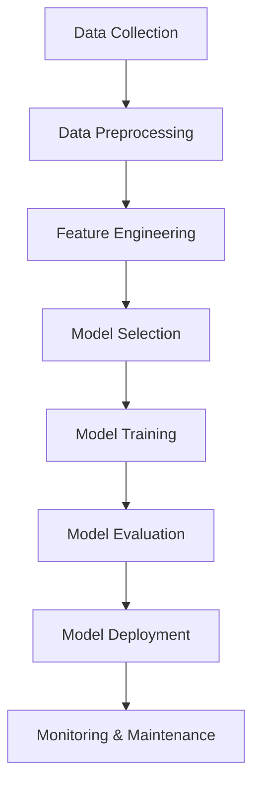

# Chapter 1: Introduction to Machine Learning Workflows

## The Evolution of Machine Learning Development

Machine learning has transformed from an academic pursuit into a critical business tool. However, the journey from raw data to production-ready ML models is fraught with challenges. This chapter explores the complexities of modern ML workflows and introduces ThinkML as a solution to streamline this process.

## Understanding Machine Learning Workflows

A typical machine learning workflow consists of several interconnected stages:



Each stage presents unique challenges:

1. **Data Collection**: Gathering diverse data sources, ensuring data quality
2. **Preprocessing**: Handling missing values, outliers, and data inconsistencies
3. **Feature Engineering**: Creating meaningful features, handling categorical variables
4. **Model Selection**: Choosing appropriate algorithms, considering business constraints
5. **Model Training**: Managing computational resources, handling large datasets
6. **Model Evaluation**: Selecting appropriate metrics, validating model performance
7. **Model Deployment**: Integrating with existing systems, ensuring scalability
8. **Monitoring**: Tracking model performance, detecting data drift

## The Need for ThinkML

Traditional ML development often involves:

- Writing repetitive boilerplate code
- Managing complex dependencies between workflow stages
- Difficulty in reproducing results
- Challenges in scaling from prototype to production
- Lack of standardization across projects

ThinkML addresses these challenges by providing:

1. **Unified Interface**: Consistent API across all ML workflow stages
2. **Automated Workflows**: Built-in pipelines for common ML tasks
3. **Reproducibility**: Version-controlled experiments and results
4. **Scalability**: Seamless transition from development to production
5. **Best Practices**: Industry-standard implementations of ML algorithms

## Getting Started with ThinkML

Let's look at a simple example of how ThinkML simplifies the ML workflow:

```python
from thinkml import Pipeline
from thinkml.preprocessing import StandardScaler
from thinkml.models import RandomForestClassifier
from thinkml.evaluation import ClassificationMetrics

# Create a pipeline
pipeline = Pipeline([
    ('scaler', StandardScaler()),
    ('classifier', RandomForestClassifier())
])

# Train the pipeline
pipeline.fit(X_train, y_train)

# Make predictions
predictions = pipeline.predict(X_test)

# Evaluate the model
metrics = ClassificationMetrics(y_test, predictions)
print(f"Accuracy: {metrics.accuracy():.3f}")
```

## Key Features of ThinkML

1. **Modular Design**: Each component can be used independently or as part of a pipeline
2. **Extensible Architecture**: Easy to add custom components and algorithms
3. **Comprehensive Documentation**: Detailed guides and examples for each feature
4. **Active Community**: Regular updates and contributions from users
5. **Production-Ready**: Built-in support for model serving and monitoring

## Who Should Use ThinkML?

ThinkML is designed for:

- **Data Scientists**: Streamline your ML workflow and focus on insights
- **ML Engineers**: Build robust, production-ready ML systems
- **Students**: Learn ML best practices through practical examples
- **Business Analysts**: Implement ML solutions without deep technical expertise

## What's Next?

In the following chapters, we'll dive deep into each component of the ML workflow and explore how ThinkML makes each stage more efficient and reliable. We'll cover:

- Detailed installation and setup instructions
- Data preprocessing techniques and best practices
- Feature engineering strategies
- Model selection and validation approaches
- Deployment and monitoring solutions
- Real-world case studies and examples

## Summary

This chapter introduced the challenges in modern ML workflows and how ThinkML addresses them. We explored the key features of ThinkML and saw a simple example of its usage. The following chapters will provide detailed coverage of each aspect, helping you master machine learning workflows with ThinkML. 