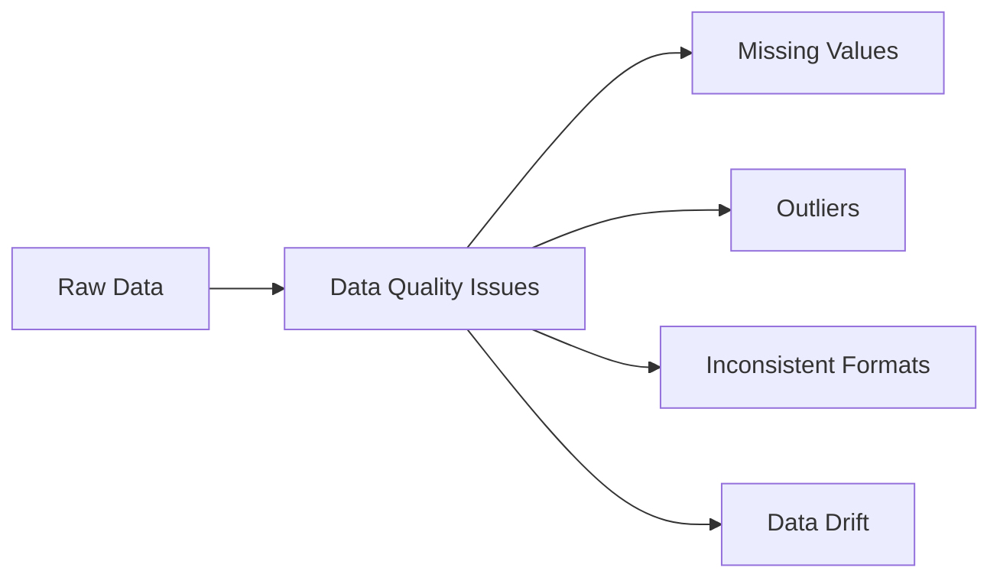
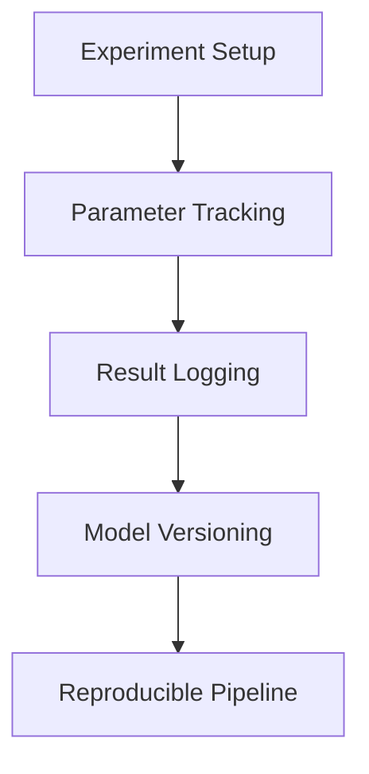

# Chapter 2: Why ThinkML? Solving Real ML Challenges

## The State of Machine Learning Development

Machine learning development today faces several critical challenges that often lead to project failures, delays, and increased costs. Let's examine these challenges and how ThinkML addresses them.

## Common Challenges in ML Development

### 1. Data Quality and Consistency



Traditional approaches often require:
- Manual data cleaning scripts
- One-off solutions for each project
- Time-consuming validation processes
- Lack of standardization

ThinkML Solution:
```python
from thinkml.preprocessing import DataQualityChecker

# Automated data quality assessment
quality_checker = DataQualityChecker()
quality_report = quality_checker.analyze(df)

# Automated data cleaning pipeline
cleaner = DataCleaner(
    handle_missing='auto',
    detect_outliers=True,
    standardize_formats=True
)
clean_df = cleaner.fit_transform(df)
```

### 2. Experiment Tracking and Reproducibility



Traditional challenges:
- Lost experiment configurations
- Inconsistent environments
- Difficulty in comparing results
- Manual tracking of parameters

ThinkML Solution:
```python
from thinkml.experiments import ExperimentTracker

# Automated experiment tracking
tracker = ExperimentTracker(
    project_name="customer_churn",
    experiment_name="random_forest_v1"
)

with tracker.start_run():
    # Log parameters
    tracker.log_params({
        "n_estimators": 100,
        "max_depth": 10
    })
    
    # Train model
    model.fit(X_train, y_train)
    
    # Log metrics
    tracker.log_metrics({
        "accuracy": accuracy_score(y_test, y_pred),
        "f1": f1_score(y_test, y_pred)
    })
```

### 3. Model Deployment and Scaling


Common issues:
- Environment differences
- Scaling challenges
- Monitoring complexity
- Version management

ThinkML Solution:
```python
from thinkml.deployment import ModelDeployer

# One-click deployment
deployer = ModelDeployer(
    model=model,
    environment="production",
    scaling_config={
        "min_instances": 2,
        "max_instances": 10
    }
)

# Deploy with monitoring
deployment = deployer.deploy(
    enable_monitoring=True,
    alert_threshold=0.1
)
```

## Real-World Case Studies

### Case Study 1: E-commerce Recommendation System

**Challenge**: Building a scalable recommendation system that handles millions of users and products.

**Traditional Approach**:
- Complex distributed computing setup
- Manual scaling configuration
- Difficult monitoring
- High maintenance costs

**ThinkML Solution**:
```python
from thinkml.recommendation import RecommendationEngine

# Create recommendation engine
engine = RecommendationEngine(
    model_type="collaborative_filtering",
    scaling="auto",
    monitoring=True
)

# Train and deploy
engine.fit(user_data, product_data)
engine.deploy(
    endpoint="recommendations",
    batch_size=1000
)
```

### Case Study 2: Financial Fraud Detection

**Challenge**: Real-time fraud detection with high accuracy and low latency.

**Traditional Approach**:
- Complex pipeline management
- Difficult model updates
- Manual feature engineering
- Slow deployment cycles

**ThinkML Solution**:
```python
from thinkml.fraud import FraudDetector

# Create fraud detection system
detector = FraudDetector(
    model_type="anomaly_detection",
    features=["transaction_amount", "time_of_day", "location"],
    update_frequency="daily"
)

# Deploy with real-time monitoring
detector.deploy(
    latency_threshold_ms=100,
    alert_on_drift=True
)
```

## Key Differentiators of ThinkML

1. **Unified Development Experience**
   - Consistent API across all stages
   - Integrated development environment
   - Automated workflow management

2. **Production-Ready Features**
   - Built-in scaling capabilities
   - Automated monitoring
   - Easy deployment options

3. **Best Practices Integration**
   - Industry-standard implementations
   - Automated code quality checks
   - Security best practices

4. **Extensibility**
   - Custom component support
   - Plugin architecture
   - Community contributions

## Summary

ThinkML addresses the fundamental challenges in modern ML development by providing:
- Automated data quality management
- Reproducible experiment tracking
- Simplified deployment and scaling
- Integrated monitoring and maintenance

The next chapter will guide you through setting up ThinkML and exploring its library structure. 