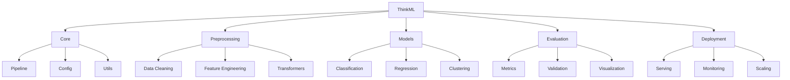

# Chapter 3: Setting Up ThinkML

## Installation Guide

ThinkML is designed to be easy to install and set up. This chapter covers everything you need to get started with ThinkML in your development environment.

### System Requirements

- Python 3.8 or higher
- 4GB RAM minimum (8GB recommended)
- 2GB disk space
- Internet connection for package downloads

### Installation Methods

#### 1. Using pip (Recommended)

```bash
# Create a virtual environment (recommended)
python -m venv thinkml-env
source thinkml-env/bin/activate  # On Windows: thinkml-env\Scripts\activate

# Install ThinkML
pip install thinkml
```

#### 2. Using conda

```bash
# Create a conda environment
conda create -n thinkml-env python=3.8
conda activate thinkml-env

# Install ThinkML
conda install -c conda-forge thinkml
```

#### 3. From Source

```bash
# Clone the repository
git clone https://github.com/thinkml/thinkml.git
cd thinkml

# Install dependencies and ThinkML
pip install -e .
```

## Library Structure

ThinkML follows a modular architecture that makes it easy to understand and extend. Here's an overview of the main components:



### Core Components

#### 1. Pipeline Module

The Pipeline module is the heart of ThinkML, providing a unified interface for creating ML workflows:

```python
from thinkml import Pipeline
from thinkml.preprocessing import StandardScaler
from thinkml.models import RandomForestClassifier

# Create a simple pipeline
pipeline = Pipeline([
    ('scaler', StandardScaler()),
    ('classifier', RandomForestClassifier())
])

# Fit and transform
pipeline.fit(X_train, y_train)
predictions = pipeline.predict(X_test)
```

#### 2. Configuration Management

ThinkML provides a flexible configuration system:

```python
from thinkml.config import Config

# Load configuration
config = Config.from_yaml('config.yaml')

# Access configuration values
model_params = config.get('model.parameters')
preprocessing_steps = config.get('preprocessing.steps')
```

### Preprocessing Module

The preprocessing module handles data preparation:

```python
from thinkml.preprocessing import (
    DataCleaner,
    FeatureEngineer,
    DataTransformer
)

# Data cleaning
cleaner = DataCleaner(
    handle_missing='auto',
    detect_outliers=True
)

# Feature engineering
engineer = FeatureEngineer(
    create_interactions=True,
    polynomial_features=2
)

# Data transformation
transformer = DataTransformer(
    scaling='standard',
    encoding='onehot'
)
```

### Models Module

The models module provides various ML algorithms:

```python
from thinkml.models import (
    ClassificationModels,
    RegressionModels,
    ClusteringModels
)

# Classification
clf = ClassificationModels.RandomForest(
    n_estimators=100,
    max_depth=10
)

# Regression
reg = RegressionModels.XGBoost(
    learning_rate=0.1,
    n_estimators=100
)

# Clustering
clust = ClusteringModels.KMeans(
    n_clusters=5,
    random_state=42
)
```

### Evaluation Module

The evaluation module provides tools for model assessment:

```python
from thinkml.evaluation import (
    ClassificationMetrics,
    RegressionMetrics,
    CrossValidator
)

# Classification metrics
metrics = ClassificationMetrics(y_true, y_pred)
print(f"Accuracy: {metrics.accuracy():.3f}")
print(f"F1 Score: {metrics.f1_score():.3f}")

# Cross-validation
cv = CrossValidator(
    n_splits=5,
    scoring='accuracy'
)
scores = cv.cross_validate(model, X, y)
```

### Deployment Module

The deployment module handles model serving and monitoring:

```python
from thinkml.deployment import (
    ModelServer,
    ModelMonitor,
    ScalingManager
)

# Model serving
server = ModelServer(
    model=model,
    port=8000,
    workers=4
)

# Model monitoring
monitor = ModelMonitor(
    model=model,
    metrics=['accuracy', 'latency'],
    alert_threshold=0.1
)

# Scaling management
scaler = ScalingManager(
    min_instances=2,
    max_instances=10,
    scale_up_threshold=0.8
)
```

## Project Structure

A typical ThinkML project structure looks like this:

```
project/
├── data/
│   ├── raw/
│   ├── processed/
│   └── features/
├── models/
│   ├── trained/
│   └── deployed/
├── notebooks/
│   └── experiments/
├── src/
│   ├── preprocessing/
│   ├── models/
│   └── evaluation/
├── tests/
├── config.yaml
└── README.md
```

## Configuration File Example

Here's an example `config.yaml` file:

```yaml
project:
  name: customer_churn
  version: 1.0.0

data:
  path: data/raw/customer_data.csv
  target: churn
  features:
    - age
    - tenure
    - monthly_charges

preprocessing:
  steps:
    - name: handle_missing
      method: mean
    - name: scale_features
      method: standard

model:
  type: random_forest
  parameters:
    n_estimators: 100
    max_depth: 10
    random_state: 42

evaluation:
  metrics:
    - accuracy
    - f1_score
    - roc_auc
  cv_folds: 5

deployment:
  environment: production
  scaling:
    min_instances: 2
    max_instances: 10
  monitoring:
    enabled: true
    alert_threshold: 0.1
```

## Next Steps

Now that you have ThinkML installed and understand its structure, you're ready to:
1. Start preprocessing your data (Chapter 4)
2. Perform exploratory data analysis (Chapter 5)
3. Engineer features for your models (Chapter 6)

The following chapters will guide you through each of these steps in detail. 