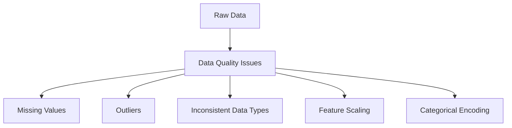

# Chapter 4: Data Preprocessing with ThinkML

## Introduction to Data Preprocessing

Data preprocessing is a crucial step in any machine learning project. It involves transforming raw data into a format that's suitable for model training. This chapter covers how ThinkML simplifies and streamlines the preprocessing workflow.

## Common Data Preprocessing Challenges



## Data Quality Assessment

ThinkML provides comprehensive tools for data quality assessment:

```python
from thinkml.preprocessing import DataQualityChecker

# Initialize the quality checker
checker = DataQualityChecker()

# Analyze data quality
quality_report = checker.analyze(df)

# View the report
print(quality_report.summary())
print(quality_report.detailed_report())
```

## Handling Missing Values

ThinkML offers multiple strategies for handling missing values:

```python
from thinkml.preprocessing import MissingValueHandler

# Initialize the handler
handler = MissingValueHandler(
    strategy='auto',  # Automatically choose the best strategy
    fill_value=None  # Custom fill value if needed
)

# Handle missing values
df_cleaned = handler.fit_transform(df)

# Or use specific strategies
handler_mean = MissingValueHandler(strategy='mean')
handler_median = MissingValueHandler(strategy='median')
handler_mode = MissingValueHandler(strategy='mode')
handler_knn = MissingValueHandler(strategy='knn', n_neighbors=5)
```

## Outlier Detection and Treatment

ThinkML provides various methods for outlier detection and treatment:

```python
from thinkml.preprocessing import OutlierHandler

# Initialize the handler
handler = OutlierHandler(
    method='zscore',  # Options: zscore, iqr, isolation_forest
    threshold=3.0,    # Threshold for zscore method
    action='clip'     # Options: clip, remove, impute
)

# Detect and handle outliers
df_clean = handler.fit_transform(df)

# Get outlier report
outlier_report = handler.get_report()
print(outlier_report)
```

## Feature Scaling and Normalization

ThinkML supports multiple scaling techniques:

```python
from thinkml.preprocessing import Scaler

# Standard scaling
standard_scaler = Scaler(method='standard')
X_scaled = standard_scaler.fit_transform(X)

# Min-Max scaling
minmax_scaler = Scaler(method='minmax')
X_scaled = minmax_scaler.fit_transform(X)

# Robust scaling
robust_scaler = Scaler(method='robust')
X_scaled = robust_scaler.fit_transform(X)
```

## Categorical Variable Encoding

ThinkML provides various encoding methods for categorical variables:

```python
from thinkml.preprocessing import CategoricalEncoder

# One-hot encoding
onehot_encoder = CategoricalEncoder(method='onehot')
X_encoded = onehot_encoder.fit_transform(X)

# Label encoding
label_encoder = CategoricalEncoder(method='label')
X_encoded = label_encoder.fit_transform(X)

# Target encoding
target_encoder = CategoricalEncoder(method='target')
X_encoded = target_encoder.fit_transform(X, y)
```

## Data Type Conversion

ThinkML simplifies data type conversion:

```python
from thinkml.preprocessing import TypeConverter

# Initialize the converter
converter = TypeConverter(
    auto_detect=True,  # Automatically detect and convert types
    force_numeric=True # Force numeric conversion where possible
)

# Convert data types
df_converted = converter.fit_transform(df)
```

## Creating Preprocessing Pipelines

ThinkML makes it easy to create preprocessing pipelines:

```python
from thinkml import Pipeline
from thinkml.preprocessing import (
    MissingValueHandler,
    OutlierHandler,
    Scaler,
    CategoricalEncoder
)

# Create a preprocessing pipeline
preprocessing_pipeline = Pipeline([
    ('missing_handler', MissingValueHandler(strategy='auto')),
    ('outlier_handler', OutlierHandler(method='zscore')),
    ('scaler', Scaler(method='standard')),
    ('encoder', CategoricalEncoder(method='onehot'))
])

# Fit and transform the data
X_processed = preprocessing_pipeline.fit_transform(X)
```

## Advanced Preprocessing Features

### 1. Time Series Data Preprocessing

```python
from thinkml.preprocessing import TimeSeriesPreprocessor

# Initialize the preprocessor
preprocessor = TimeSeriesPreprocessor(
    resample_freq='D',  # Daily resampling
    fill_method='ffill', # Forward fill
    handle_outliers=True
)

# Process time series data
df_processed = preprocessor.fit_transform(df)
```

### 2. Text Data Preprocessing

```python
from thinkml.preprocessing import TextPreprocessor

# Initialize the preprocessor
preprocessor = TextPreprocessor(
    lowercase=True,
    remove_stopwords=True,
    remove_punctuation=True,
    stemming=True
)

# Process text data
text_processed = preprocessor.fit_transform(text_data)
```

### 3. Image Data Preprocessing

```python
from thinkml.preprocessing import ImagePreprocessor

# Initialize the preprocessor
preprocessor = ImagePreprocessor(
    resize=(224, 224),
    normalize=True,
    augment=True
)

# Process image data
images_processed = preprocessor.fit_transform(image_data)
```

## Best Practices for Data Preprocessing

1. **Data Quality First**
   - Always start with data quality assessment
   - Document data issues and their treatments
   - Validate preprocessing results

2. **Pipeline Management**
   - Create reusable preprocessing pipelines
   - Version control your preprocessing steps
   - Test pipelines on different datasets

3. **Performance Optimization**
   - Use appropriate data types
   - Implement efficient preprocessing methods
   - Consider memory usage

4. **Reproducibility**
   - Save preprocessing parameters
   - Document all transformations
   - Use consistent random seeds

## Example: Complete Preprocessing Workflow

Here's a complete example of a preprocessing workflow:

```python
from thinkml import Pipeline
from thinkml.preprocessing import (
    DataQualityChecker,
    MissingValueHandler,
    OutlierHandler,
    Scaler,
    CategoricalEncoder
)

# 1. Data Quality Assessment
checker = DataQualityChecker()
quality_report = checker.analyze(df)
print("Data Quality Report:", quality_report.summary())

# 2. Create Preprocessing Pipeline
preprocessing_pipeline = Pipeline([
    ('missing_handler', MissingValueHandler(strategy='auto')),
    ('outlier_handler', OutlierHandler(method='zscore')),
    ('scaler', Scaler(method='standard')),
    ('encoder', CategoricalEncoder(method='onehot'))
])

# 3. Fit and Transform
X_processed = preprocessing_pipeline.fit_transform(X)

# 4. Validate Results
validation_report = preprocessing_pipeline.validate(X_processed)
print("Validation Report:", validation_report)
```

## Next Steps

After preprocessing your data, you're ready to:
1. Perform exploratory data analysis (Chapter 5)
2. Engineer features for your models (Chapter 6)
3. Select and train your models (Chapter 7)

The following chapters will guide you through these steps in detail. 