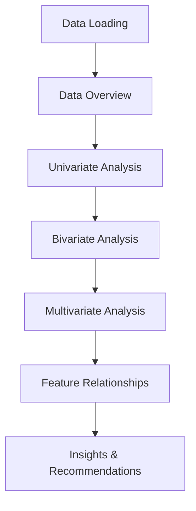

# Chapter 5: Exploratory Data Analysis with ThinkML

## Introduction to Exploratory Data Analysis

Exploratory Data Analysis (EDA) is a crucial step in understanding your data before building models. ThinkML provides comprehensive tools for EDA, making it easier to discover patterns, relationships, and potential issues in your data.

## The EDA Workflow



## Data Overview and Summary Statistics

ThinkML provides tools for quick data overview:

```python
from thinkml.analysis import DataAnalyzer

# Initialize the analyzer
analyzer = DataAnalyzer()

# Get basic information
info = analyzer.get_info(df)
print("Dataset Info:", info)

# Get summary statistics
summary = analyzer.get_summary(df)
print("Summary Statistics:", summary)

# Get data types and memory usage
types = analyzer.get_types(df)
print("Data Types:", types)
```

## Univariate Analysis

### Numerical Variables

```python
from thinkml.analysis import UnivariateAnalyzer

# Initialize the analyzer
analyzer = UnivariateAnalyzer()

# Analyze numerical variables
numerical_analysis = analyzer.analyze_numerical(df)

# Generate plots
analyzer.plot_distributions(df)
analyzer.plot_boxplots(df)
analyzer.plot_histograms(df)
```

### Categorical Variables

```python
# Analyze categorical variables
categorical_analysis = analyzer.analyze_categorical(df)

# Generate plots
analyzer.plot_bar_charts(df)
analyzer.plot_pie_charts(df)
```

## Bivariate Analysis

ThinkML provides tools for analyzing relationships between variables:

```python
from thinkml.analysis import BivariateAnalyzer

# Initialize the analyzer
analyzer = BivariateAnalyzer()

# Analyze relationships
relationships = analyzer.analyze_relationships(df)

# Generate correlation plots
analyzer.plot_correlation_matrix(df)
analyzer.plot_scatter_plots(df)
analyzer.plot_box_plots_by_category(df)
```

## Multivariate Analysis

### Principal Component Analysis (PCA)

```python
from thinkml.analysis import MultivariateAnalyzer

# Initialize the analyzer
analyzer = MultivariateAnalyzer()

# Perform PCA
pca_results = analyzer.perform_pca(df, n_components=2)

# Plot PCA results
analyzer.plot_pca(pca_results)
```

### Feature Importance Analysis

```python
# Analyze feature importance
importance = analyzer.analyze_feature_importance(df, target='target')

# Plot feature importance
analyzer.plot_feature_importance(importance)
```

## Advanced EDA Features

### 1. Time Series Analysis

```python
from thinkml.analysis import TimeSeriesAnalyzer

# Initialize the analyzer
analyzer = TimeSeriesAnalyzer()

# Analyze time series data
analysis = analyzer.analyze_time_series(df, date_column='date')

# Generate time series plots
analyzer.plot_trends(df)
analyzer.plot_seasonality(df)
analyzer.plot_decomposition(df)
```

### 2. Text Data Analysis

```python
from thinkml.analysis import TextAnalyzer

# Initialize the analyzer
analyzer = TextAnalyzer()

# Analyze text data
analysis = analyzer.analyze_text(df, text_column='text')

# Generate text analysis plots
analyzer.plot_word_frequency(df)
analyzer.plot_sentiment_distribution(df)
analyzer.plot_topic_distribution(df)
```

### 3. Image Data Analysis

```python
from thinkml.analysis import ImageAnalyzer

# Initialize the analyzer
analyzer = ImageAnalyzer()

# Analyze image data
analysis = analyzer.analyze_images(df, image_column='image')

# Generate image analysis plots
analyzer.plot_image_statistics(df)
analyzer.plot_feature_maps(df)
```

## Automated EDA Reports

ThinkML can generate comprehensive EDA reports:

```python
from thinkml.analysis import AutoEDA

# Initialize AutoEDA
auto_eda = AutoEDA()

# Generate comprehensive report
report = auto_eda.generate_report(df)

# Save report to HTML
auto_eda.save_report(report, 'eda_report.html')

# Generate insights
insights = auto_eda.generate_insights(df)
print("Key Insights:", insights)
```

## Interactive Visualizations

ThinkML provides interactive visualization capabilities:

```python
from thinkml.visualization import InteractivePlotter

# Initialize the plotter
plotter = InteractivePlotter()

# Create interactive plots
plotter.plot_interactive_scatter(df)
plotter.plot_interactive_histogram(df)
plotter.plot_interactive_boxplot(df)
```

## Best Practices for EDA

1. **Systematic Approach**
   - Start with basic data overview
   - Progress from univariate to multivariate analysis
   - Document all findings and insights

2. **Visualization Guidelines**
   - Choose appropriate plot types
   - Use clear labels and titles
   - Maintain consistent styling

3. **Analysis Documentation**
   - Record all analysis steps
   - Document assumptions and decisions
   - Save visualizations and reports

4. **Performance Considerations**
   - Use efficient data structures
   - Implement lazy loading for large datasets
   - Cache intermediate results

## Example: Complete EDA Workflow

Here's a complete example of an EDA workflow:

```python
from thinkml.analysis import (
    DataAnalyzer,
    UnivariateAnalyzer,
    BivariateAnalyzer,
    MultivariateAnalyzer,
    AutoEDA
)

# 1. Initial Data Analysis
data_analyzer = DataAnalyzer()
info = data_analyzer.get_info(df)
summary = data_analyzer.get_summary(df)

# 2. Univariate Analysis
univariate = UnivariateAnalyzer()
numerical_analysis = univariate.analyze_numerical(df)
categorical_analysis = univariate.analyze_categorical(df)

# 3. Bivariate Analysis
bivariate = BivariateAnalyzer()
relationships = bivariate.analyze_relationships(df)

# 4. Multivariate Analysis
multivariate = MultivariateAnalyzer()
pca_results = multivariate.perform_pca(df)
importance = multivariate.analyze_feature_importance(df)

# 5. Generate Comprehensive Report
auto_eda = AutoEDA()
report = auto_eda.generate_report(df)
insights = auto_eda.generate_insights(df)

# 6. Save Results
auto_eda.save_report(report, 'eda_report.html')
```

## Next Steps

After completing your EDA, you're ready to:
1. Engineer features based on your insights (Chapter 6)
2. Select appropriate models (Chapter 7)
3. Train and evaluate your models (Chapter 8)

The following chapters will guide you through these steps in detail. 