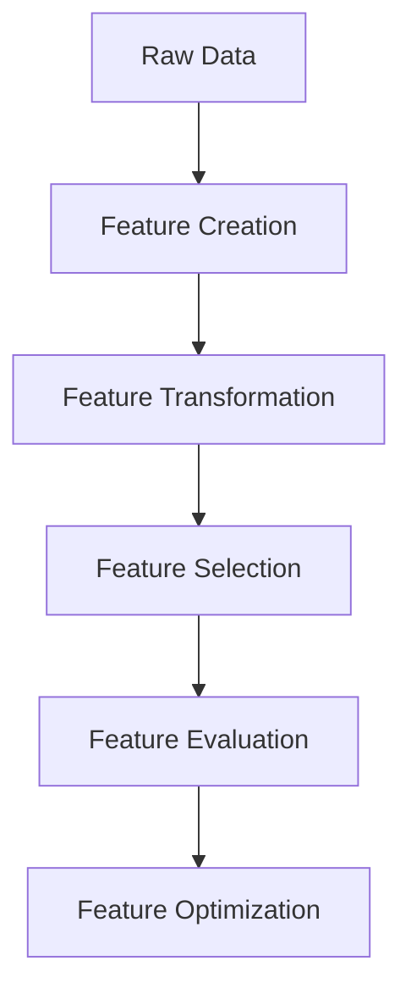

# Chapter 6: Feature Engineering and Selection with ThinkML

## Introduction to Feature Engineering

Feature engineering is the process of transforming raw data into meaningful features that improve model performance. ThinkML provides comprehensive tools for feature engineering and selection, making it easier to create and evaluate features.

## The Feature Engineering Workflow



## Feature Creation

ThinkML provides tools for creating new features:

```python
from thinkml.features import FeatureCreator

# Initialize the feature creator
creator = FeatureCreator()

# Create numerical features
numerical_features = creator.create_numerical_features(df, {
    'ratio': ['feature1', 'feature2'],
    'product': ['feature3', 'feature4'],
    'log': ['feature5'],
    'square': ['feature6']
})

# Create categorical features
categorical_features = creator.create_categorical_features(df, {
    'combine': ['cat1', 'cat2'],
    'frequency': ['cat3'],
    'target_encoding': ['cat4']
})

# Create time-based features
time_features = creator.create_time_features(df, {
    'date_column': 'timestamp',
    'features': ['hour', 'day', 'month', 'year', 'dayofweek']
})
```

## Feature Transformation

### Numerical Transformations

```python
from thinkml.features import FeatureTransformer

# Initialize the transformer
transformer = FeatureTransformer()

# Apply transformations
transformed_features = transformer.transform_numerical(df, {
    'scaling': ['feature1', 'feature2'],
    'normalization': ['feature3'],
    'log_transform': ['feature4'],
    'polynomial': ['feature5', 'degree': 2]
})
```

### Categorical Transformations

```python
# Transform categorical features
transformed_categorical = transformer.transform_categorical(df, {
    'onehot': ['cat1', 'cat2'],
    'label': ['cat3'],
    'target': ['cat4'],
    'frequency': ['cat5']
})
```

## Feature Selection

ThinkML provides multiple feature selection methods:

```python
from thinkml.features import FeatureSelector

# Initialize the selector
selector = FeatureSelector()

# Select features using different methods
selected_features = selector.select_features(df, {
    'variance': {'threshold': 0.01},
    'correlation': {'threshold': 0.8},
    'mutual_info': {'k': 10},
    'recursive': {'estimator': 'random_forest', 'n_features': 20}
})
```

## Advanced Feature Engineering

### 1. Time Series Features

```python
from thinkml.features import TimeSeriesFeatureEngineer

# Initialize the engineer
engineer = TimeSeriesFeatureEngineer()

# Create time series features
time_features = engineer.create_features(df, {
    'lag': [1, 2, 3],
    'rolling': ['mean', 'std', 'max'],
    'expanding': ['mean', 'std'],
    'differencing': [1, 2]
})
```

### 2. Text Features

```python
from thinkml.features import TextFeatureEngineer

# Initialize the engineer
engineer = TextFeatureEngineer()

# Create text features
text_features = engineer.create_features(df, {
    'tfidf': {'max_features': 1000},
    'word2vec': {'size': 100},
    'sentiment': True,
    'topic_modeling': {'n_topics': 10}
})
```

### 3. Image Features

```python
from thinkml.features import ImageFeatureEngineer

# Initialize the engineer
engineer = ImageFeatureEngineer()

# Create image features
image_features = engineer.create_features(df, {
    'cnn': {'model': 'resnet50'},
    'color': ['histogram', 'moments'],
    'texture': ['glcm', 'lbp'],
    'shape': ['hu_moments']
})
```

## Feature Evaluation

ThinkML provides tools for evaluating feature importance and quality:

```python
from thinkml.features import FeatureEvaluator

# Initialize the evaluator
evaluator = FeatureEvaluator()

# Evaluate features
evaluation = evaluator.evaluate_features(df, target='target', {
    'importance': ['random_forest', 'xgboost'],
    'correlation': ['pearson', 'spearman'],
    'mutual_info': True,
    'variance': True
})

# Get feature rankings
rankings = evaluator.get_feature_rankings(evaluation)
print("Feature Rankings:", rankings)
```

## Feature Optimization

ThinkML can help optimize feature sets:

```python
from thinkml.features import FeatureOptimizer

# Initialize the optimizer
optimizer = FeatureOptimizer()

# Optimize feature set
optimized_features = optimizer.optimize_features(df, {
    'target': 'target',
    'metric': 'accuracy',
    'method': 'genetic',
    'population_size': 100,
    'generations': 50
})
```

## Creating Feature Pipelines

ThinkML makes it easy to create feature engineering pipelines:

```python
from thinkml import Pipeline
from thinkml.features import (
    FeatureCreator,
    FeatureTransformer,
    FeatureSelector
)

# Create a feature engineering pipeline
feature_pipeline = Pipeline([
    ('creator', FeatureCreator()),
    ('transformer', FeatureTransformer()),
    ('selector', FeatureSelector())
])

# Fit and transform
X_processed = feature_pipeline.fit_transform(X)
```

## Best Practices for Feature Engineering

1. **Feature Creation**
   - Create features based on domain knowledge
   - Document feature creation logic
   - Validate feature quality

2. **Feature Selection**
   - Use multiple selection methods
   - Consider feature importance
   - Balance feature count and model complexity

3. **Feature Evaluation**
   - Assess feature importance
   - Check for multicollinearity
   - Validate feature stability

4. **Feature Optimization**
   - Optimize feature sets
   - Monitor feature performance
   - Update features as needed

## Example: Complete Feature Engineering Workflow

Here's a complete example of a feature engineering workflow:

```python
from thinkml.features import (
    FeatureCreator,
    FeatureTransformer,
    FeatureSelector,
    FeatureEvaluator,
    FeatureOptimizer
)

# 1. Create Features
creator = FeatureCreator()
numerical_features = creator.create_numerical_features(df)
categorical_features = creator.create_categorical_features(df)
time_features = creator.create_time_features(df)

# 2. Transform Features
transformer = FeatureTransformer()
transformed_numerical = transformer.transform_numerical(df)
transformed_categorical = transformer.transform_categorical(df)

# 3. Select Features
selector = FeatureSelector()
selected_features = selector.select_features(df)

# 4. Evaluate Features
evaluator = FeatureEvaluator()
evaluation = evaluator.evaluate_features(df)
rankings = evaluator.get_feature_rankings(evaluation)

# 5. Optimize Features
optimizer = FeatureOptimizer()
optimized_features = optimizer.optimize_features(df)

# 6. Create Final Feature Set
final_features = pd.concat([
    transformed_numerical,
    transformed_categorical,
    time_features
], axis=1)
```

## Next Steps

After engineering your features, you're ready to:
1. Select appropriate models (Chapter 7)
2. Train and evaluate your models (Chapter 8)
3. Optimize model hyperparameters (Chapter 9)

The following chapters will guide you through these steps in detail. 