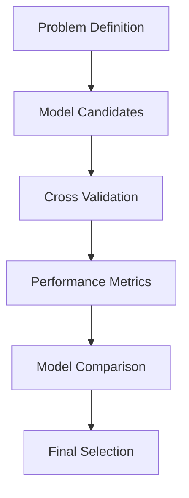

# Chapter 7: Model Selection and Validation with ThinkML

## Introduction to Model Selection

Model selection is a critical step in the machine learning workflow. ThinkML provides comprehensive tools for selecting, validating, and comparing different models to find the best solution for your problem.

## The Model Selection Workflow



## Understanding Your Problem

Before selecting models, it's crucial to understand your problem type:

```python
from thinkml.models import ProblemAnalyzer

# Initialize the analyzer
analyzer = ProblemAnalyzer()

# Analyze the problem
problem_info = analyzer.analyze_problem(X, y)
print("Problem Type:", problem_info.type)
print("Problem Characteristics:", problem_info.characteristics)
```

## Model Selection Strategies

ThinkML provides various model selection strategies:

```python
from thinkml.models import ModelSelector

# Initialize the selector
selector = ModelSelector()

# Select models based on problem type
models = selector.select_models(
    problem_type='classification',
    data_size=len(X),
    feature_count=X.shape[1],
    constraints={
        'interpretability': 'high',
        'training_time': 'fast',
        'memory_usage': 'low'
    }
)

# Get model recommendations
recommendations = selector.get_recommendations()
print("Recommended Models:", recommendations)
```

## Cross-Validation

ThinkML supports multiple cross-validation strategies:

```python
from thinkml.validation import CrossValidator

# Initialize the validator
validator = CrossValidator()

# Perform k-fold cross-validation
kfold_results = validator.kfold_cross_validate(
    model=model,
    X=X,
    y=y,
    k=5,
    scoring='accuracy'
)

# Perform stratified cross-validation
stratified_results = validator.stratified_cross_validate(
    model=model,
    X=X,
    y=y,
    k=5,
    scoring='f1'
)

# Perform time series cross-validation
timeseries_results = validator.timeseries_cross_validate(
    model=model,
    X=X,
    y=y,
    n_splits=5,
    scoring='rmse'
)
```

## Performance Metrics

ThinkML provides comprehensive performance metrics:

```python
from thinkml.evaluation import ModelEvaluator

# Initialize the evaluator
evaluator = ModelEvaluator()

# Evaluate classification model
classification_metrics = evaluator.evaluate_classification(
    y_true=y_test,
    y_pred=y_pred,
    metrics=['accuracy', 'precision', 'recall', 'f1', 'roc_auc']
)

# Evaluate regression model
regression_metrics = evaluator.evaluate_regression(
    y_true=y_test,
    y_pred=y_pred,
    metrics=['mse', 'rmse', 'mae', 'r2']
)

# Evaluate clustering model
clustering_metrics = evaluator.evaluate_clustering(
    X=X,
    labels=labels,
    metrics=['silhouette', 'calinski_harabasz', 'davies_bouldin']
)
```

## Model Comparison

ThinkML provides tools for comparing models:

```python
from thinkml.models import ModelComparer

# Initialize the comparer
comparer = ModelComparer()

# Compare multiple models
comparison = comparer.compare_models(
    models={
        'random_forest': rf_model,
        'xgboost': xgb_model,
        'lightgbm': lgb_model
    },
    X=X_test,
    y=y_test,
    metrics=['accuracy', 'f1', 'training_time']
)

# Generate comparison report
report = comparer.generate_report(comparison)
print("Comparison Report:", report)
```

## Advanced Model Selection

### 1. Ensemble Methods

```python
from thinkml.models import EnsembleBuilder

# Initialize the ensemble builder
builder = EnsembleBuilder()

# Create voting ensemble
voting_ensemble = builder.create_voting_ensemble(
    models=[model1, model2, model3],
    voting='soft'
)

# Create stacking ensemble
stacking_ensemble = builder.create_stacking_ensemble(
    base_models=[model1, model2],
    meta_model=meta_model
)

# Create bagging ensemble
bagging_ensemble = builder.create_bagging_ensemble(
    base_model=base_model,
    n_estimators=10
)
```

### 2. Model Selection with Constraints

```python
from thinkml.models import ConstrainedModelSelector

# Initialize the selector
selector = ConstrainedModelSelector()

# Select models with constraints
models = selector.select_models(
    constraints={
        'max_training_time': 3600,  # seconds
        'max_memory_usage': '8GB',
        'min_accuracy': 0.95,
        'max_model_size': '100MB'
    }
)
```

## Model Validation Best Practices

1. **Data Splitting**
   - Use appropriate validation strategies
   - Consider data characteristics
   - Maintain data distribution

2. **Metric Selection**
   - Choose relevant metrics
   - Consider business requirements
   - Balance multiple objectives

3. **Validation Process**
   - Document validation steps
   - Track model versions
   - Validate assumptions

4. **Model Selection Criteria**
   - Consider model complexity
   - Evaluate interpretability
   - Assess deployment requirements

## Example: Complete Model Selection Workflow

Here's a complete example of a model selection workflow:

```python
from thinkml.models import (
    ProblemAnalyzer,
    ModelSelector,
    ModelComparer
)
from thinkml.validation import CrossValidator
from thinkml.evaluation import ModelEvaluator

# 1. Analyze Problem
analyzer = ProblemAnalyzer()
problem_info = analyzer.analyze_problem(X, y)

# 2. Select Candidate Models
selector = ModelSelector()
models = selector.select_models(
    problem_type=problem_info.type,
    constraints={
        'interpretability': 'high',
        'training_time': 'fast'
    }
)

# 3. Cross-Validate Models
validator = CrossValidator()
cv_results = {}
for name, model in models.items():
    results = validator.kfold_cross_validate(
        model=model,
        X=X,
        y=y,
        k=5
    )
    cv_results[name] = results

# 4. Evaluate Models
evaluator = ModelEvaluator()
eval_results = {}
for name, model in models.items():
    y_pred = model.predict(X_test)
    metrics = evaluator.evaluate_classification(
        y_true=y_test,
        y_pred=y_pred
    )
    eval_results[name] = metrics

# 5. Compare Models
comparer = ModelComparer()
comparison = comparer.compare_models(
    models=models,
    cv_results=cv_results,
    eval_results=eval_results
)

# 6. Select Best Model
best_model = comparer.select_best_model(
    comparison,
    criteria=['accuracy', 'f1', 'training_time']
)
```

## Next Steps

After selecting your model, you're ready to:
1. Train and evaluate your model (Chapter 8)
2. Optimize model hyperparameters (Chapter 9)
3. Deploy your model (Chapter 10)

The following chapters will guide you through these steps in detail. 