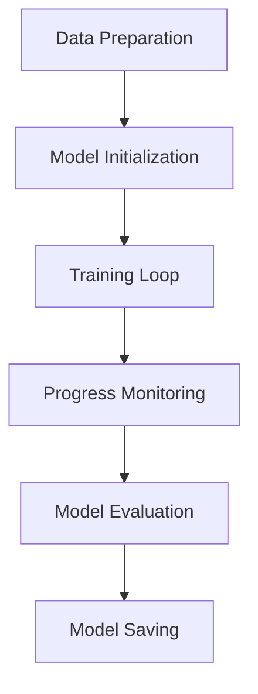

# Chapter 8: Model Training and Evaluation with ThinkML

## Introduction to Model Training

Model training is a crucial phase in the machine learning workflow. ThinkML provides comprehensive tools for training, monitoring, and evaluating models efficiently.

## The Model Training Workflow



## Model Training Setup

ThinkML provides flexible training configurations:

```python
from thinkml.training import TrainingConfig

# Create training configuration
config = TrainingConfig(
    batch_size=32,
    epochs=100,
    learning_rate=0.001,
    optimizer='adam',
    early_stopping=True,
    validation_split=0.2,
    callbacks=['checkpoint', 'tensorboard']
)

# Initialize trainer
trainer = ModelTrainer(config)
```

## Training Process

### Basic Training

```python
from thinkml.training import ModelTrainer

# Initialize trainer
trainer = ModelTrainer()

# Train model
history = trainer.train(
    model=model,
    X_train=X_train,
    y_train=y_train,
    X_val=X_val,
    y_val=y_val
)

# Get training metrics
metrics = trainer.get_metrics()
print("Training Metrics:", metrics)
```

### Advanced Training Options

```python
# Train with custom loss function
trainer.train(
    model=model,
    X_train=X_train,
    y_train=y_train,
    loss_fn=custom_loss,
    metrics=['accuracy', 'f1']
)

# Train with class weights
trainer.train(
    model=model,
    X_train=X_train,
    y_train=y_train,
    class_weights={0: 1.0, 1: 2.0}
)

# Train with data augmentation
trainer.train(
    model=model,
    X_train=X_train,
    y_train=y_train,
    augmentation=True
)
```

## Training Monitoring

ThinkML provides comprehensive training monitoring:

```python
from thinkml.monitoring import TrainingMonitor

# Initialize monitor
monitor = TrainingMonitor()

# Monitor training progress
monitor.track_progress(
    model=model,
    metrics=['loss', 'accuracy'],
    interval=100  # steps
)

# Get real-time metrics
current_metrics = monitor.get_current_metrics()
print("Current Metrics:", current_metrics)

# Plot training progress
monitor.plot_progress()
```

## Model Evaluation

### Comprehensive Evaluation

```python
from thinkml.evaluation import ModelEvaluator

# Initialize evaluator
evaluator = ModelEvaluator()

# Evaluate model
evaluation = evaluator.evaluate(
    model=model,
    X_test=X_test,
    y_test=y_test,
    metrics=['accuracy', 'precision', 'recall', 'f1', 'roc_auc']
)

# Generate evaluation report
report = evaluator.generate_report(evaluation)
print("Evaluation Report:", report)
```

### Performance Analysis

```python
# Analyze model performance
analysis = evaluator.analyze_performance(
    model=model,
    X_test=X_test,
    y_test=y_test
)

# Get performance metrics
metrics = analysis.get_metrics()
print("Performance Metrics:", metrics)

# Plot performance curves
analysis.plot_roc_curve()
analysis.plot_precision_recall_curve()
analysis.plot_confusion_matrix()
```

## Model Saving and Loading

ThinkML provides tools for model persistence:

```python
from thinkml.models import ModelManager

# Initialize manager
manager = ModelManager()

# Save model
manager.save_model(
    model=model,
    path='models/model_v1',
    metadata={
        'version': '1.0',
        'training_date': '2024-04-26',
        'metrics': metrics
    }
)

# Load model
loaded_model = manager.load_model('models/model_v1')
```

## Advanced Training Features

### 1. Distributed Training

```python
from thinkml.training import DistributedTrainer

# Initialize distributed trainer
trainer = DistributedTrainer(
    strategy='mirrored',
    num_gpus=2
)

# Train model distributed
history = trainer.train(
    model=model,
    X_train=X_train,
    y_train=y_train
)
```

### 2. Transfer Learning

```python
from thinkml.training import TransferLearner

# Initialize transfer learner
learner = TransferLearner(
    base_model='resnet50',
    fine_tune_layers=5
)

# Fine-tune model
fine_tuned_model = learner.fine_tune(
    model=model,
    X_train=X_train,
    y_train=y_train,
    epochs=10
)
```

### 3. Active Learning

```python
from thinkml.training import ActiveLearner

# Initialize active learner
learner = ActiveLearner(
    model=model,
    strategy='uncertainty'
)

# Train with active learning
history = learner.train(
    X_labeled=X_labeled,
    y_labeled=y_labeled,
    X_unlabeled=X_unlabeled,
    n_iterations=5
)
```

## Training Best Practices

1. **Data Preparation**
   - Ensure data quality
   - Handle class imbalance
   - Normalize features

2. **Training Process**
   - Monitor training progress
   - Use early stopping
   - Save checkpoints

3. **Evaluation**
   - Use appropriate metrics
   - Validate on multiple datasets
   - Document results

4. **Model Management**
   - Version control models
   - Track experiments
   - Document changes

## Example: Complete Training Workflow

Here's a complete example of a training workflow:

```python
from thinkml.training import (
    TrainingConfig,
    ModelTrainer,
    TrainingMonitor
)
from thinkml.evaluation import ModelEvaluator
from thinkml.models import ModelManager

# 1. Setup Training Configuration
config = TrainingConfig(
    batch_size=32,
    epochs=100,
    learning_rate=0.001,
    early_stopping=True
)

# 2. Initialize Components
trainer = ModelTrainer(config)
monitor = TrainingMonitor()
evaluator = ModelEvaluator()
manager = ModelManager()

# 3. Train Model
history = trainer.train(
    model=model,
    X_train=X_train,
    y_train=y_train,
    X_val=X_val,
    y_val=y_val
)

# 4. Monitor Training
monitor.track_progress(model, metrics=['loss', 'accuracy'])
monitor.plot_progress()

# 5. Evaluate Model
evaluation = evaluator.evaluate(
    model=model,
    X_test=X_test,
    y_test=y_test
)
report = evaluator.generate_report(evaluation)

# 6. Save Model
manager.save_model(
    model=model,
    path='models/final_model',
    metadata={
        'version': '1.0',
        'metrics': evaluation.metrics
    }
)
```

## Next Steps

After training your model, you're ready to:
1. Optimize model hyperparameters (Chapter 9)
2. Deploy your model (Chapter 10)
3. Monitor model performance (Chapter 11)

The following chapters will guide you through these steps in detail. 