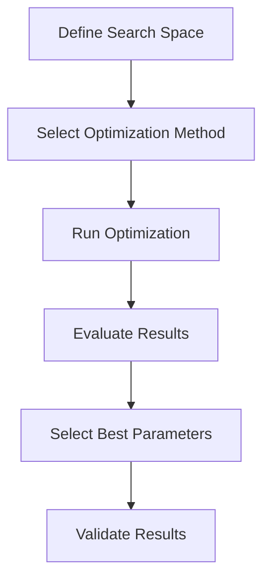

# Chapter 9: Hyperparameter Optimization with ThinkML

## Introduction to Hyperparameter Optimization

Hyperparameter optimization is crucial for achieving optimal model performance. ThinkML provides comprehensive tools for automating and streamlining the hyperparameter tuning process.

## The Hyperparameter Optimization Workflow



## Defining the Search Space

ThinkML provides flexible ways to define parameter search spaces:

```python
from thinkml.optimization import SearchSpace

# Create search space
search_space = SearchSpace({
    'learning_rate': (0.0001, 0.1, 'log'),
    'n_estimators': (50, 500, 'int'),
    'max_depth': (3, 20, 'int'),
    'min_samples_split': (2, 20, 'int'),
    'min_samples_leaf': (1, 10, 'int')
})

# Define parameter constraints
constraints = {
    'max_depth': lambda x: x > 5,
    'min_samples_split': lambda x: x > 2
}
```

## Optimization Methods

ThinkML supports multiple optimization strategies:

### 1. Grid Search

```python
from thinkml.optimization import GridSearch

# Initialize grid search
grid_search = GridSearch(
    search_space=search_space,
    cv=5,
    scoring='accuracy',
    n_jobs=-1
)

# Run grid search
results = grid_search.optimize(
    model=model,
    X=X_train,
    y=y_train
)

# Get best parameters
best_params = grid_search.get_best_parameters()
print("Best Parameters:", best_params)
```

### 2. Random Search

```python
from thinkml.optimization import RandomSearch

# Initialize random search
random_search = RandomSearch(
    search_space=search_space,
    n_iter=100,
    cv=5,
    scoring='accuracy'
)

# Run random search
results = random_search.optimize(
    model=model,
    X=X_train,
    y=y_train
)
```

### 3. Bayesian Optimization

```python
from thinkml.optimization import BayesianOptimization

# Initialize Bayesian optimization
bayes_opt = BayesianOptimization(
    search_space=search_space,
    n_iter=50,
    cv=5,
    scoring='accuracy'
)

# Run Bayesian optimization
results = bayes_opt.optimize(
    model=model,
    X=X_train,
    y=y_train
)
```

### 4. Genetic Algorithm

```python
from thinkml.optimization import GeneticOptimization

# Initialize genetic optimization
genetic_opt = GeneticOptimization(
    search_space=search_space,
    population_size=50,
    n_generations=20,
    cv=5,
    scoring='accuracy'
)

# Run genetic optimization
results = genetic_opt.optimize(
    model=model,
    X=X_train,
    y=y_train
)
```

## Advanced Optimization Features

### 1. Early Stopping

```python
from thinkml.optimization import EarlyStopping

# Configure early stopping
early_stopping = EarlyStopping(
    patience=5,
    min_delta=0.001
)

# Use in optimization
results = optimizer.optimize(
    model=model,
    X=X_train,
    y=y_train,
    early_stopping=early_stopping
)
```

### 2. Parallel Optimization

```python
from thinkml.optimization import ParallelOptimizer

# Initialize parallel optimizer
parallel_opt = ParallelOptimizer(
    n_jobs=-1,
    backend='ray'
)

# Run parallel optimization
results = parallel_opt.optimize(
    model=model,
    X=X_train,
    y=y_train,
    search_space=search_space
)
```

### 3. Multi-Objective Optimization

```python
from thinkml.optimization import MultiObjectiveOptimizer

# Initialize multi-objective optimizer
multi_obj_opt = MultiObjectiveOptimizer(
    objectives=['accuracy', 'training_time'],
    weights=[0.7, 0.3]
)

# Run multi-objective optimization
results = multi_obj_opt.optimize(
    model=model,
    X=X_train,
    y=y_train,
    search_space=search_space
)
```

## Optimization Results Analysis

ThinkML provides tools for analyzing optimization results:

```python
from thinkml.optimization import OptimizationAnalyzer

# Initialize analyzer
analyzer = OptimizationAnalyzer()

# Analyze results
analysis = analyzer.analyze_results(results)

# Plot optimization history
analyzer.plot_optimization_history(results)

# Plot parameter importance
analyzer.plot_parameter_importance(results)

# Generate optimization report
report = analyzer.generate_report(results)
print("Optimization Report:", report)
```

## Best Practices for Hyperparameter Optimization

1. **Search Space Definition**
   - Define meaningful ranges
   - Consider parameter dependencies
   - Use appropriate scales

2. **Optimization Strategy**
   - Choose appropriate method
   - Balance exploration/exploitation
   - Consider computational resources

3. **Validation Process**
   - Use cross-validation
   - Validate on multiple datasets
   - Check for overfitting

4. **Results Analysis**
   - Document all experiments
   - Analyze parameter importance
   - Validate final results

## Example: Complete Optimization Workflow

Here's a complete example of a hyperparameter optimization workflow:

```python
from thinkml.optimization import (
    SearchSpace,
    BayesianOptimization,
    OptimizationAnalyzer
)
from thinkml.models import ModelEvaluator

# 1. Define Search Space
search_space = SearchSpace({
    'learning_rate': (0.0001, 0.1, 'log'),
    'n_estimators': (50, 500, 'int'),
    'max_depth': (3, 20, 'int')
})

# 2. Initialize Optimizer
optimizer = BayesianOptimization(
    search_space=search_space,
    n_iter=50,
    cv=5,
    scoring='accuracy'
)

# 3. Run Optimization
results = optimizer.optimize(
    model=model,
    X=X_train,
    y=y_train
)

# 4. Analyze Results
analyzer = OptimizationAnalyzer()
analysis = analyzer.analyze_results(results)
report = analyzer.generate_report(results)

# 5. Validate Best Parameters
evaluator = ModelEvaluator()
best_params = results.get_best_parameters()
validation = evaluator.validate(
    model=model,
    params=best_params,
    X=X_val,
    y=y_val
)

# 6. Save Results
optimizer.save_results(
    results,
    path='optimization_results',
    metadata={
        'model_type': 'random_forest',
        'dataset': 'classification',
        'date': '2024-04-26'
    }
)
```

## Next Steps

After optimizing your model's hyperparameters, you're ready to:
1. Deploy your model (Chapter 10)
2. Monitor model performance (Chapter 11)
3. Scale your solution (Chapter 12)

The following chapters will guide you through these steps in detail. 