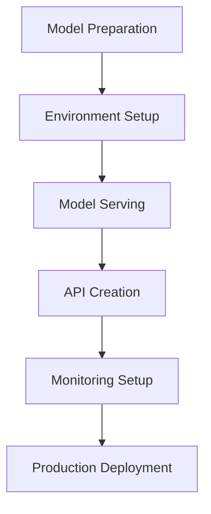

# Chapter 10: Model Deployment and Persistence with ThinkML

## Introduction to Model Deployment

Model deployment is a critical phase in the machine learning lifecycle. ThinkML provides comprehensive tools for deploying, serving, and monitoring models in production environments.

## The Model Deployment Workflow



## Model Preparation

ThinkML provides tools for preparing models for deployment:

```python
from thinkml.deployment import ModelPreparator

# Initialize preparator
preparator = ModelPreparator()

# Prepare model for deployment
prepared_model = preparator.prepare(
    model=model,
    metadata={
        'version': '1.0',
        'training_date': '2024-04-26',
        'framework': 'sklearn',
        'dependencies': ['numpy', 'pandas']
    }
)

# Validate model
validation = preparator.validate(prepared_model)
print("Validation Results:", validation)
```

## Environment Management

ThinkML helps manage deployment environments:

```python
from thinkml.deployment import EnvironmentManager

# Initialize environment manager
env_manager = EnvironmentManager()

# Create deployment environment
environment = env_manager.create_environment(
    name='production',
    python_version='3.8',
    dependencies={
        'numpy': '1.21.0',
        'pandas': '1.3.0',
        'scikit-learn': '0.24.2'
    }
)

# Validate environment
validation = env_manager.validate_environment(environment)
print("Environment Validation:", validation)
```

## Model Serving

ThinkML provides multiple serving options:

### 1. REST API Server

```python
from thinkml.serving import RESTAPIServer

# Initialize REST API server
server = RESTAPIServer(
    model=model,
    host='0.0.0.0',
    port=8000,
    workers=4
)

# Start server
server.start()

# Make predictions
predictions = server.predict(data)
```

### 2. gRPC Server

```python
from thinkml.serving import GRPCServer

# Initialize gRPC server
server = GRPCServer(
    model=model,
    host='0.0.0.0',
    port=50051
)

# Start server
server.start()
```

### 3. Batch Processing

```python
from thinkml.serving import BatchProcessor

# Initialize batch processor
processor = BatchProcessor(
    model=model,
    batch_size=1000
)

# Process batch predictions
results = processor.process_batch(data)
```

## API Creation

ThinkML simplifies API creation:

```python
from thinkml.api import APICreator

# Initialize API creator
creator = APICreator()

# Create REST API
api = creator.create_rest_api(
    model=model,
    endpoints=['predict', 'health'],
    documentation=True
)

# Create gRPC API
grpc_api = creator.create_grpc_api(
    model=model,
    services=['prediction', 'health']
)
```

## Monitoring Setup

ThinkML provides comprehensive monitoring capabilities:

```python
from thinkml.monitoring import ModelMonitor

# Initialize monitor
monitor = ModelMonitor(
    model=model,
    metrics=['accuracy', 'latency', 'throughput'],
    alert_threshold=0.1
)

# Start monitoring
monitor.start()

# Get monitoring metrics
metrics = monitor.get_metrics()
print("Monitoring Metrics:", metrics)
```

## Production Deployment

ThinkML supports various deployment platforms:

### 1. Kubernetes Deployment

```python
from thinkml.deployment import KubernetesDeployer

# Initialize Kubernetes deployer
deployer = KubernetesDeployer()

# Deploy to Kubernetes
deployment = deployer.deploy(
    model=model,
    namespace='production',
    replicas=3,
    resources={
        'cpu': '1',
        'memory': '2Gi'
    }
)
```

### 2. Cloud Platform Deployment

```python
from thinkml.deployment import CloudDeployer

# Initialize cloud deployer
deployer = CloudDeployer(platform='aws')

# Deploy to cloud
deployment = deployer.deploy(
    model=model,
    instance_type='t2.medium',
    region='us-west-2'
)
```

### 3. Edge Deployment

```python
from thinkml.deployment import EdgeDeployer

# Initialize edge deployer
deployer = EdgeDeployer()

# Deploy to edge devices
deployment = deployer.deploy(
    model=model,
    devices=['device1', 'device2'],
    optimization='quantization'
)
```

## Advanced Deployment Features

### 1. A/B Testing

```python
from thinkml.deployment import ABTesting

# Initialize A/B testing
ab_test = ABTesting(
    model_a=model_a,
    model_b=model_b,
    traffic_split=0.5
)

# Run A/B test
results = ab_test.run(
    duration_days=30,
    metrics=['accuracy', 'user_satisfaction']
)
```

### 2. Canary Deployment

```python
from thinkml.deployment import CanaryDeployer

# Initialize canary deployer
deployer = CanaryDeployer()

# Perform canary deployment
deployment = deployer.deploy(
    model=model,
    traffic_percentage=0.1,
    duration_hours=24
)
```

### 3. Blue-Green Deployment

```python
from thinkml.deployment import BlueGreenDeployer

# Initialize blue-green deployer
deployer = BlueGreenDeployer()

# Perform blue-green deployment
deployment = deployer.deploy(
    new_model=model,
    rollback_threshold=0.1
)
```

## Best Practices for Model Deployment

1. **Environment Management**
   - Use containerization
   - Version dependencies
   - Document requirements

2. **Security**
   - Implement authentication
   - Encrypt sensitive data
   - Monitor access

3. **Monitoring**
   - Track performance metrics
   - Set up alerts
   - Log predictions

4. **Scalability**
   - Use load balancing
   - Implement caching
   - Monitor resources

## Example: Complete Deployment Workflow

Here's a complete example of a deployment workflow:

```python
from thinkml.deployment import (
    ModelPreparator,
    EnvironmentManager,
    KubernetesDeployer
)
from thinkml.monitoring import ModelMonitor
from thinkml.api import APICreator

# 1. Prepare Model
preparator = ModelPreparator()
prepared_model = preparator.prepare(model)

# 2. Setup Environment
env_manager = EnvironmentManager()
environment = env_manager.create_environment(
    name='production',
    python_version='3.8'
)

# 3. Create API
creator = APICreator()
api = creator.create_rest_api(
    model=prepared_model,
    documentation=True
)

# 4. Setup Monitoring
monitor = ModelMonitor(
    model=prepared_model,
    metrics=['accuracy', 'latency']
)

# 5. Deploy to Kubernetes
deployer = KubernetesDeployer()
deployment = deployer.deploy(
    model=prepared_model,
    namespace='production',
    replicas=3
)

# 6. Start Monitoring
monitor.start()
```

## Next Steps

After deploying your model, you're ready to:
1. Monitor model performance (Chapter 11)
2. Scale your solution (Chapter 12)
3. Maintain and update your model (Chapter 13)

The following chapters will guide you through these steps in detail. 